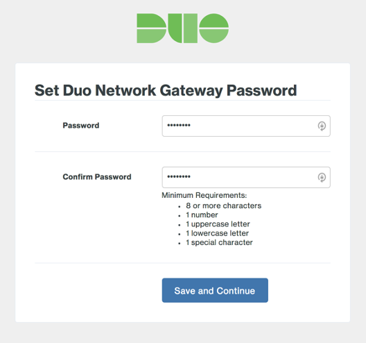
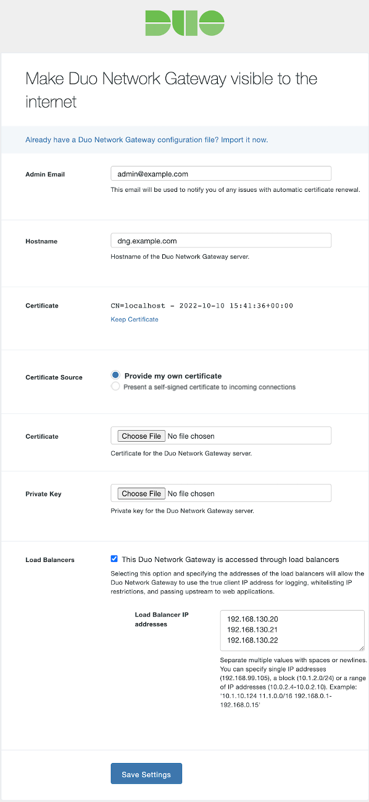
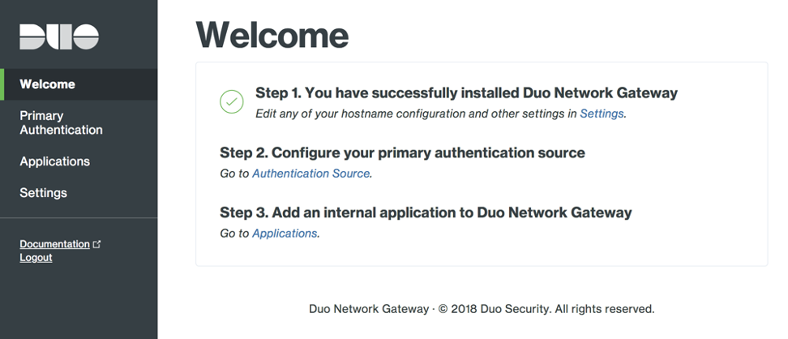

// Add steps as necessary for accessing the software, post-configuration, and testing. Don’t include full usage instructions for your software, but add links to your product documentation for that information.
//Should any sections not be applicable, remove them

== Post deployment steps
// If steps are required to test the deployment, add them here. If not, remove the heading

Once the Quick Start has been successfully created, you may now interact with Duo Network Gateway from a web browser. In a browser navigate to https://URL-OF-NETWORK-GATEWAY-LOAD-BALANCER:8443 from a network in the AdminServerRemoteAccessCIDR subnet to log into the Duo Network Gateway admin console. Your browser will warn you about an untrusted certificate the first time you access the page. Dismiss the warning and continue onto the page. 

The first page of the Duo Network Gateway setup screen will ask you to choose a password for the Duo Network Gateway admin console. Once you've entered a password that meets the requirements, click Save and Continue.

On the "Make Duo Network Gateway visible to the internet" page fill in the following fields. You can also click the "Already have a Duo Network Gateway configuration file? Import it now.

As this Quick Start uses load balancers presenting SSL to end-users, you have the option to additionally utilize a certificate for the connection between the load balance and the Duo Network Gateway. There are two options for providing this certificate. 

If you would like to supply your own SSL certificate for DNG, click *Change Certificate* to select *Provide my own certificate*. 

You also have the option of using self-signed certificates for the Duo Network Gateway server. If you would like to do this, you can select the *Present a self-signed certificate to incoming connections* option.

Check the box next to *This Duo Network Gateway is accessed through load balancers*. Specify the internal IP addresses of your DNG portal server load balancer,  found in the outputs section of the Quick Start. This setting makes the Duo Network Gateway aware of the Load Balancer IP addresses and as a result allows the use of the source client IP addresses for logging, applying allowed IP restrictions, and passing IP addresses to protected applications.

If all information isn't entered completely and correctly or this initial configuration fails to save you'll need to re-enter the information again before proceeding, including selection of the certificate and key. 

Click *Save and Continue*. Saving your configuration redirects you to the Duo Network Gateway admin console. At this point you will have the basic management configuration completed for Duo Network Gateway; you may proceed to add a SAML Authentication Source, and then configure Duo Network Gateway to proxy the applications you wish to add Duo policies to. 

At this point you can follow the official https://duo.com/docs/dng#configure-the-duo-network-gateway-authentication-source[Duo documentation^].

== Security
// Provide post-deployment best practices for using the technology on AWS, including considerations such as migrating data, backups, ensuring high performance, high availability, etc. Link to software documentation for detailed information.

The Quickstart exposes two user-configurable security group access parameters, AdminServerRemoteAccessCIDR and PortalServerRemoteAccessCIDR. It is imperative that the AdminServerRemoteAccessCIDR should be accessible only on authorized network ranges for both ports 22 and 8443 and NOT widely internet accessible.
