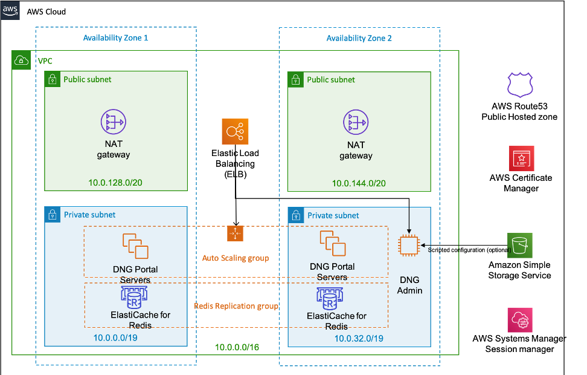

Deploying this Quick Start for a new virtual private cloud (VPC) with
*default parameters* builds the following _{partner-product-name}_ environment in the
AWS Cloud.

// Replace this example diagram with your own. Send us your source PowerPoint file. Be sure to follow our guidelines here : http://(we should include these points on our contributors giude)
[#architecture1]
.Quick Start architecture for _{partner-product-name}_ on AWS
[link=images/architecture_diagram.png]

As shown in Figure 1, the Quick Start sets up the following:

* A highly available architecture that spans two Availability Zones.*
* A VPC configured with public and private subnets, according to AWS
best practices, to provide you with your own virtual network on AWS.*

In the public subnets:

* Managed network address translation (NAT) gateways to allow outbound
internet access for resources in the private subnets.*
* Application Load balancers to load balance traffic to the Duo Network Gateway Portal servers and the Duo Network Gateway Admin server.*

In the private subnets:
// Add bullet points for any additional components that are included in the deployment. Make sure that the additional components are also represented in the architecture diagram.
* Duo Network Gateway Portal Servers which end-users will use to interface with Duo Network Gateway.
* Duo Network Gateway Admin Server for configuring Duo Network Gateway.
* An Elasticache Redis instance, which holds the configuration and state for Duo Network Gateway.

* An AWS Route53 Public Hosted Zone to traffic for the Duo Network Gateway domain and its subdomains.
* SSL/TSL certificates in AWS Certificate Manager for the Duo Network Gateway Portal server and Duo Network Gateway Admin server load balancers.
* AWS Systems Manager Session Manager to manage access to the Duo Network Gateway Portal and Duo Network Gateway Admin server.
* Optional: Amazon S3 Bucket for Duo Network Gateway Portal server scripted deployment.

*The template that deploys the Quick Start into an existing VPC skips
the components marked by asterisks and prompts you for your existing VPC
configuration.
