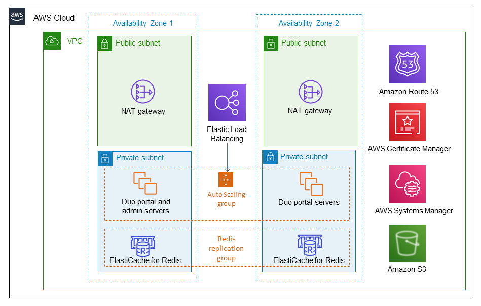

Deploying this Quick Start for a new VPC with default parameters builds the following {partner-product-name} environment in the AWS Cloud.

// Replace this example diagram with your own. Send us your source PowerPoint file. Be sure to follow our guidelines here : http://(we should include these points on our contributors giude)
[#architecture1]
.Quick Start architecture for {partner-product-name} on AWS
[link=images/CDNG-architecture-diagram.png]

As shown in figure 1, the Quick Start sets up the following:

* A highly available architecture that spans two Availability Zones.*
* A VPC configured with public and private subnets, according to AWS
best practices, to provide you with your own virtual network on AWS.*
* In the public subnets, managed network address translation (NAT) gateways to allow outbound internet access for resources in the private subnets.*
* In the private subnets:
// Add bullet points for any additional components that are included in the deployment. Make sure that the additional components are also represented in the architecture diagram.
** {partner-product-name} portal servers for providing end users access to the product interface.
** A {partner-product-name} admin server for completing configuration tasks. 
** An Amazon ElastiCache for Redis instance with a Redis replication group for storing the configuration for {partner-product-name}.
* Elastic Load Balancing for accepting incoming traffic for the {partner-product-name} admin server and then distributing that traffic to the {partner-product-name} portal servers using an AWS Auto Scaling group. 
* An Amazon Route 53 public hosted zone to route traffic for the {partner-product-name} domain and its subdomains.
* SSL/TSL certificates in AWS Certificate Manager (ACM) for the {partner-product-name} portal and admin server load balancers.
* AWS Systems Manager to manage access to the {partner-product-name} portal and admin servers.
* (Optional) Amazon Simple Storage Service (Amazon S3) bucket for {partner-product-name} portal server scripted deployment.

*The template that deploys the Quick Start into an existing VPC skips
the components marked by asterisks and prompts you for your existing VPC
configuration.
