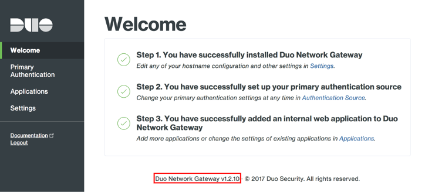

// Add any tips or answers to anticipated questions. This could include the following troubleshooting information. If you don’t have any other Q&A to add, change “FAQ” to “Troubleshooting.”

== FAQ
*Q.* How do I output {partner-product-name} docker logs to a file?

*A.* To export the logs, connect via SSH to the {partner-product-name} server and run the following command. You may need to replace the example DNG YML name with the name of your current file:

`+docker-compose -p network-gateway -f network-gateway-1.5.5.yml logs > Dng.log+`

Now, everything is exported to a Dng.log file outside of your docker container. After exporting your logs, you can cancel the log by pressing *Ctrl + C*.

*Q.* Can I create web applications for {partner-product-name} in bulk?

*A.* Yes. You can use a configuration file to create web applications in bulk, store your settings locally in source control, automatically deploy, and make changes to {partner-product-name} without having to access the admin console.

For more information, see https://duo.com/docs/dng-scripted-config[Scripted Configuration for Duo Network Gateway^].

*Q.* How do I determine the current version number of {partner-product-name}?

*A.* To determine the current version number of {partner-product-name}, log in to the {partner-product-name} admin console and check the footer:

*Q.* How do I interpret and troubleshoot {partner-product-name} issues?

*A.* For a list of common error messages with descriptions and resolutions, see the https://help.duo.com/s/article/dng-issues-guide?language=en_US[official Duo Security Knowledge Base^]. 

*Q.* I encountered a *CREATE_FAILED* error when I launched the Quick Start. What should I do?

*A.* If AWS CloudFormation fails to create the stack, relaunch the template with *Rollback on failure* set to *No*. (This setting is under *Advanced* in the AWS CloudFormation console on the *Options* page.) With this setting, the stack’s state is retained and the instance is left running, so you can troubleshoot the issue. (For Windows, look at the log files in %ProgramFiles%\Amazon\EC2ConfigService and C:\cfn\log.)
// If you’re deploying on Linux instances, provide the location for log files on Linux, or omit this sentence.

WARNING: When you set *Rollback on failure* to *Disabled*, you continue to incur AWS charges for this stack. Be sure to delete the stack when you finish troubleshooting.

For additional information, see https://docs.aws.amazon.com/AWSCloudFormation/latest/UserGuide/troubleshooting.html[Troubleshooting AWS CloudFormation^] on the AWS website.

*Q.* I encountered a size limitation error when I deployed the AWS CloudFormation templates.

*A.* Launch the Quick Start templates from the links in this guide or from another S3 bucket. If you deploy the templates from a local copy on your computer or from a location other than an S3 bucket, you might encounter template size limitations. For more information about AWS CloudFormation quotas, see http://docs.aws.amazon.com/AWSCloudFormation/latest/UserGuide/cloudformation-limits.html[AWS CloudFormation quotas^].

//== Troubleshooting

//<Steps for troubleshooting the deployment go here.>